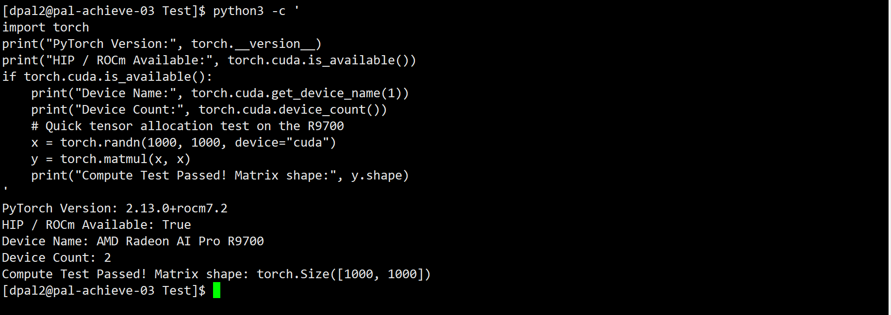
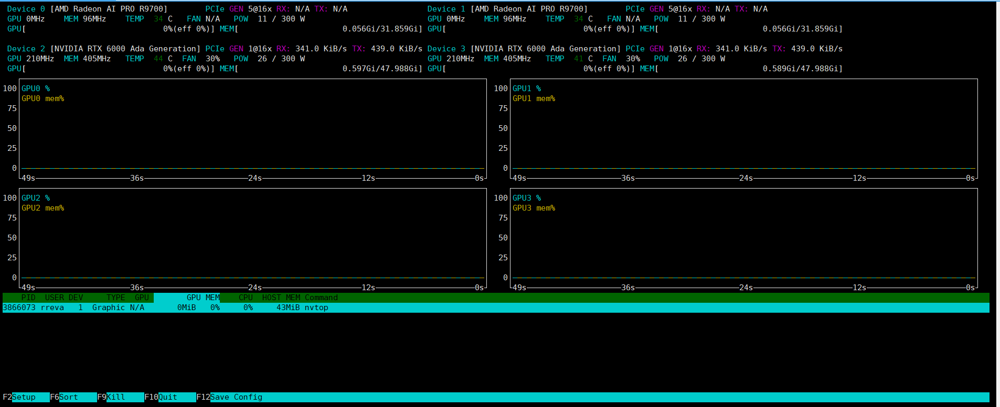

# Instructions for Using Pal-ACHIEVE Lab Servers

The following table details the IP addresses for all the PAL Achieve Lab Servers. 
| Server Name | Server IP | Server Processor | Server Memory | Server Capability | OS |
|----------|----------|----------| ----------| ----------| ----------| 
| pal-achieve-01.ece.uic.edu | 10.7.48.77 | Intel(R) Xeon(R) CPU  X5482  @ 3.20GHz | 24GB | Simple Compute Server for EDA Tools | RHEL 8.10 |
| pal-achieve-02.ece.uic.edu | 10.7.48.235 |  Intel(R) Xeon(R) CPU  X5482  @ 3.20GHz | 24GB | AMD VCK 5000 FPGA, FPGA Compilation, FPGA EMulation, Simple Compute Server for EDA Tools,  | RHEL 8.10 |
| pal-achieve-03.ece.uic.edu | 10.7.48.87 | Intel(R) Xeon(R) w9-3495X | 1 TB | 2 NVIDIA 6000 Ada Lovelace GPUs, 2 AMD Radeon™ AI PRO R9700, ML/DL Training, FPGA Compilation | RHEL 9.8 |
| pal-achieve-04.ece.uic.edu | 10.7.48.65 | Intel(R) Xeon(R) w5-3433 | 512 GB | 2 AMD U55C FPGAs, 1 AMD U250 FPGA, NVIDIA T400, ML/DL Training, FPGA Compilation, FPGA Emulation | RHEL 8.10 | 

# File System

| Server Name | Local Filesystem | Remote Filesystem | 
|----------|----------|----------| 
| pal-achieve-01.ece.uic.edu | 1 TB (`/scratch`) | 5 TB (`/data/1, /data/2, /data/3, /data/4, /data/5`) | 
| pal-achieve-02.ece.uic.edu | 1 TB (`/scratch`) | 5 TB (`/data/1, /data/2, /data/3, /data/4, /data/5`) | 
| pal-achieve-03.ece.uic.edu | 1 TB (`/scratch`), 16 TB (`/storage/1, /storage/2`) | 5 TB (`/data/1, /data/2, /data/3, /data/4, /data/5`) | 
| pal-achieve-04.ece.uic.edu | 1 TB (`/scratch`) | 5 TB (`/data/1, /data/2, /data/3, /data/4, /data/5`) | 

## How to connect to the servers?

Once you are added to the pal-achieve LDAP and the ECE CoE VPN, connect to UIC VPN using CISCO AnyConnect. More information to connect to UIC VPN is available [here](https://it.uic.edu/services/faculty-staff/uic-network/uic-vpn/). Once you are connected to UIC VPN, connect to the approrpriate server using the IP address given in the above Tabel.

## Where to work in the servers?

Once you are logged in, do the following.

    cd /scratch
    mkdir -pv <NetID> # It is paramount that you make the directory with your NetID and NetID only
    cd <NetID> # This is your work directory (/scratch/<NetID>, e.g., /scratch/dpal2, use this for coding etc)
    cd /storage/1/
    mkdir -pv <NetID> # Meant for storing large model storage, like LLMs. Set your HF or other Cache Directory to /storage/1/<NetID> (e.g., /storage/1/dpal2)

 1. **DO NOT STORE ANYTHING IN YOUR HOME DIRECTORY. IT WILL CREATE INSTABILITY.** 
 2. **Clean up space as you are done with your work. Space is limited and shared acorss many students. You can backup your data in Box. Ask me (Debjit) for a dedicated directory in Box to save your data if you are working with me. If you are working with any advisor, backup approrpiately.**
 3. **Use Python Virtual Environment for your work. Under any circusmstances, root or sudo permission will not be given.**

## What are the available softwares?
To see availble softwares

    module avail

To load a software

    module load <module_name> # (module load python/3.12)

To unload a software

    module unload <module_name> #(module unload python/3.12)

## Calendar to Book GPU Access

**You should book a calendar for your GPU job.**\
To view GPU Calendar: [GPU Calendar](https://outlook.office365.com/owa/calendar/39750c3bb71543ea97ac0add10b67f13@uic.edu/3dfa0f8be8d54bd696e76506153ebbce3272411645614296831/calendar.html)\
To book pn GPU Calendar: Book on the shared calendar. The calendar has been shared with you via your email.

## Details of the AMD ROCm Software Stack

    module load python-rocm/3.12rocm7.2

Use the following code to test availability of the AMD GPUs in your environment.

    python3 -c '
    import torch
    print("PyTorch Version:", torch.__version__)
    print("HIP / ROCm Available:", torch.cuda.is_available())
    if torch.cuda.is_available():
        print("Device Name:", torch.cuda.get_device_name(1))
        print("Device Count:", torch.cuda.device_count())
        # Quick tensor allocation test on the R9700
        x = torch.randn(1000, 1000, device="cuda")
        y = torch.matmul(x, x)
        print("Compute Test Passed! Matrix shape:", y.shape)

You should see something like the following.

Voila. You are ready to use AMD GPUs.

**Please do not create your own Virtual Environments. Use this centralized virtual environment. Inside PyTorch, AMD GPUs are still identified via cuda string, so nothing to worry.**

## Details of the NVIDIA CUDA Software Stack

    module load python-cuda/3.12cuda13

## Details of the available EDA software

Details of the EDA softwares are available [here](./details/EDA.md)

## Monitoring the GPUs with nvtop

`nvtop` is an interactive, `htop`-style monitor for GPUs. For every GPU in the server it shows the current utilization, memory usage, temperature, power draw and PCIe throughput, a live graph of utilization and memory over the last ~50 seconds, and at the bottom the list of processes (PID, user, device, GPU memory, command) currently running on each GPU. Use it to check whether a GPU is free before starting a job, and to confirm that your job is actually running on the GPU you intended.

To use it, load the module first.

    module load nvtop/nvtop   # or another available version, see `module avail`
    nvtop

Press `q` (or F10) to quit.

## GPU monitoring and numbering on pal-achieve-03

pal-achieve-03 has 4 GPUs and the nvtop module (load it using module load nvtop/nvtop or nvtop/[other version]) lists all of them:

| nvtop Device | GPU | Memory |
|----------|----------|----------|
| Device 0 | AMD Radeon AI PRO R9700 | 32 GB |
| Device 1 | AMD Radeon AI PRO R9700 | 32 GB |
| Device 2 | NVIDIA RTX 6000 Ada Generation | 48 GB |
| Device 3 | NVIDIA RTX 6000 Ada Generation | 48 GB |

**Pay attention: the device numbering inside PyTorch is NOT the same as the numbering in nvtop.** When using CUDA (`module load python-cuda/3.12cuda13`), PyTorch only sees the two NVIDIA GPUs, so `cuda:0` in your code is **Device 2** in nvtop, and `cuda:1` is **Device 3**. When checking on your CUDA Pytorch job in nvtop, look at Device 2 and Device 3, not Device 0 and 1.

## Monitoring the FPGAs on pal-achieve-04

pal-achieve-04 has three AMD/Xilinx FPGAs: two Alveo U55C and one Alveo U250. They are managed through XRT (Xilinx Runtime). Before running any XRT or Vitis command, you **must** source the XRT setup script in your shell. It sets `XILINX_XRT`, and adds the XRT tools (`xrt-smi`, `xbmgmt`) and the Vitis/Vivado 2024.1 tools to your `PATH`, `LD_LIBRARY_PATH` and `PYTHONPATH`.

    source /opt/xilinx/xrt/setup.sh

You need to do this in every new shell session (or add it to your `~/.bashrc`).

To see the state of the FPGAs, run

    xrt-smi examine

This prints the system configuration, the XRT version, and a `Device(s) Present` table with one row per FPGA. On pal-achieve-04 you should see the following.

| BDF | Board | Shell |
|----------|----------|----------|
| 0000:16:00.1 | Alveo U55C | xilinx_u55c_gen3x16_xdma_base_3 |
| 0000:34:00.1 | Alveo U55C | xilinx_u55c_gen3x16_xdma_base_3 |
| 0000:ca:00.1 | Alveo U250 | xilinx_u250_gen3x16_xdma_shell_4_1 |

The **BDF** (PCIe bus:device.function) is the address you use to refer to a specific FPGA, and the **Shell** is the platform loaded on the card which your Vitis kernels must be compiled against. The `Device Ready` column should say `Yes` for every card; if it does not, the card is not usable and you should let me us know.

To look at one card in detail, pass its BDF.

    xrt-smi examine -d 0000:16:00.1          # basic info for the first U55C
    xrt-smi examine -d 0000:16:00.1 -r all   # full report (memory, thermal, power, loaded xclbin, ...)

This only covers checking the cards. **For a complete explanation of the FPGAs, the Vitis environment, and how to compile and run kernels, follow the lab's Xilinx tutorial: [https://github.com/achieve-lab/xilinx_tutorial](https://github.com/achieve-lab/xilinx_tutorial)**
