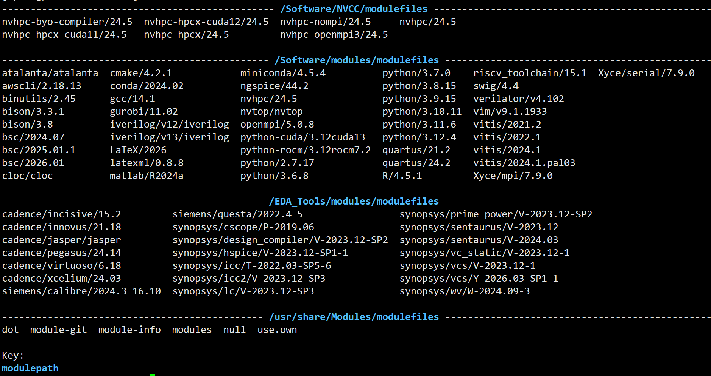

# Instructions for Using Pal-ACHIEVE Lab Servers

The following table details the IP addresses for all the PAL Achieve Lab Servers. 
| Server Name | Server IP | Server Processor | Server Memory | Server Capability | OS |
|----------|----------|----------| ----------| ----------| ----------| 
| pal-achieve-01.ece.uic.edu | 10.7.48.77 | Intel(R) Xeon(R) CPU  X5482  @ 3.20GHz | 24GB | Simple Compute Server for EDA Tools | RHEL 8.10 |
| pal-achieve-02.ece.uic.edu | 10.7.48.235 |  Intel(R) Xeon(R) CPU  X5482  @ 3.20GHz | 24GB | AMD VCK 5000 FPGA, FPGA Compilation, FPGA EMulation, Simple Compute Server for EDA Tools,  | RHEL 8.10 |
| pal-achieve-03.ece.uic.edu | 10.7.48.87 | Intel(R) Xeon(R) w9-3495X | 1 TB | 2 NVIDIA 6000 Ada Lovelace GPUs, 2 AMD Radeon™ AI PRO R9700, ML/DL Training, FPGA Compilation | RHEL 9.8 |
| pal-achieve-04.ece.uic.edu | 10.7.48.65 | Intel(R) Xeon(R) w5-3433 | 512 GB | 2 AMD U55C FPGAs, 1 AMD U250 FPGA, NVIDIA T400, ML/DL Training, FPGA Compilation, FPGA Emulation | RHEL 8.10 | 

# File System

| Server Name | Local Filesystem | Remote Filesystem | 
|----------|----------|----------| 
| pal-achieve-01.ece.uic.edu | 1 TB (/scratch) | 5 TB (/data/1, /data/2, /data/3, /data/4, /data/5) | 
| pal-achieve-02.ece.uic.edu | 1 TB (/scratch) | 5 TB (/data/1, /data/2, /data/3, /data/4, /data/5) | 
| pal-achieve-03.ece.uic.edu | 1 TB (/scratch), 16 TB (/storage/1, /storage/2) | 5 TB (/data/1, /data/2, /data/3, /data/4, /data/5) | 
| pal-achieve-04.ece.uic.edu | 1 TB (/scratch) | 5 TB (/data/1, /data/2, /data/3, /data/4, /data/5) | 

## How to connect to the servers?

Once you are added to the pal-achieve LDAP and the ECE CoE VPN, connect to UIC VPN using CISCO AnyConnect. More information to connect to UIC VPN is available [here](https://it.uic.edu/services/faculty-staff/uic-network/uic-vpn/). Once you are connected to UIC VPN, connect to the approrpriate server using the IP address given in the above Tabel.

## Where to work in the servers?

Once you are logged in, do the following.

    cd /scratch
    mkdir -pv <NetID> # It is paramount that you make the directory with your NetID and NetID only
    cd <NetID> # This is your work directory (/scratch/<NetID>, e.g., /scratch/dpal2, use this for coding etc)
    cd /storage/1/
    mkdir -pv <NetID> # Meant for storing large model storage, like LLMs. Set your HF or other Cache Directory to /storage/1/<NetID> (e.g., /storage/1/dpal2)

 1. **DO NOT STORE ANYTHING IN YOUR HOME DIRECTORY. IT WILL CREATE INSTABILITY.** 
 2. **Clean up space as you are done with your work. Space is limited and shared acorss many students. You can backup your data in Box. Ask me (Debjit) for a dedicated directory in Box to save your data if you are working with me. If you are working with any advisor, backup approrpiately.**
 3. **Use Python Virtual Environment for your work. Under any circusmstances, root or sudo permission will not be given.**

## What are the available softwares?
To see availble softwares

    module avail

To load a software

    module load <module_name> # (module load python/3.12)

To unload a software

    module unload <module_name> #(module unload python/3.12)

## Calendar to Book GPU Access

**You should book a calendar for your GPU job.**\
To view GPU Calendar: [GPU Calendar](https://outlook.office365.com/owa/calendar/39750c3bb71543ea97ac0add10b67f13@uic.edu/3dfa0f8be8d54bd696e76506153ebbce3272411645614296831/calendar.html)\
To book pn GPU Calendar: Book on the shared calendar. The calendar has been shared with you via your email.

## Details of the available EDA software

Details of the EDA softwares are available 
